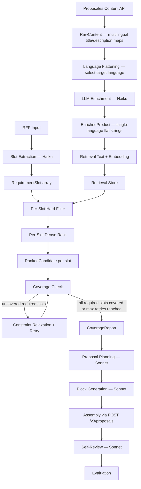
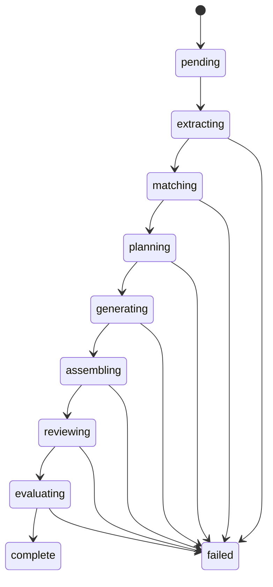

# Architecture

## System Summary

The system ingests hotel products, enriches them into structured retrieval units, maps unstructured RFPs into requirement slots, retrieves candidate matches per slot, and uses those matches to drive proposal planning and generation via the Proposales API.

The core architectural choice is slot-based retrieval rather than whole-query document retrieval.

## Data Flow



## Pipeline State Machine



Maps 1:1 to `PipelineStatus` in `src/schemas/run.ts`.

## Architectural Thesis

The dominant failure mode is not "wrong top document". It is incomplete coverage across multiple simultaneous requirements such as venue, catering, accommodation, AV, and services.

That changes the retrieval unit from:

`RFP -> top K documents`

to:

`RFP -> requirement slots -> ranked candidates per slot -> coverage report`

## API Reality

The Proposales Content API stores products with these native fields: `product_id`, `variation_id` (1:1 in current system), `title` (multilingual map, keyed by language code), `description` (multilingual map, optional), `images`, `language`, `created_at`, `is_archived`, and `sources` (integration metadata for Opera, Mews, etc.).

No category, capacity, pricing, unit, amenity, or tag fields exist natively. All retrieval-critical metadata must be created via LLM enrichment.

**Multilingual → flat transformation:** `RawContent` preserves the API's multilingual maps. During enrichment, a target language is selected and the maps are flattened to single strings in `EnrichedProduct`. This is an architecture-significant boundary — downstream retrieval and generation operate on single-language data only.

Proposal blocks reference content via `content_id` (which maps to `variation_id`). Pricing, quantity, discounts, and VAT are set at the block level during proposal assembly, not in the content library.

## Bounded Contexts

### Catalog

Responsibilities: product acquisition from API (`RawContent`), language flattening, LLM enrichment, taxonomy assignment, retrieval text construction, embedding, storage.

Primary schemas: `RawContent`, `EnrichedProduct`

### Retrieval

Responsibilities: slot extraction from RFP text, alias and constraint normalization, hard filtering, dense similarity ranking, coverage checking, gap detection with typed reasons, constraint relaxation and retry for uncovered required slots.

Primary schemas: `RequirementSlot`, `BudgetHint`, `RankedCandidate`, `SlotMatch`, `GapReason`, `CoverageReport`

**Slot field → retrieval mapping:**

| Slot Field | Used in Retrieval | How |
|---|---|---|
| `type` | Hard filter | Must match product `category` |
| `capacity` / `guests` | Hard filter | Product `capacity_max >= required` |
| `rooms` | Hard filter | For accommodation slots, product `capacity_max >= rooms` |
| `indoor_outdoor` | Hard filter | Must match if specified |
| `context` | Dense ranking | Embedded and compared via cosine similarity |
| `budget_hint` | Soft filter | Used in relaxation, not initial hard filter |
| `date` | Passthrough | No availability model in products; carried to proposal planning |
| `constraints` | Soft filter | Checked during gap analysis, relaxed on retry |
| `required` | Coverage logic | Only required slots count toward coverage ratio |

### Proposal

Responsibilities: convert coverage output into a proposal plan, generate block content per slot, map to API payload format, assemble via Proposales Create Proposal endpoint, self-review against original RFP.

Primary schemas: `ProposalBlock` (internal planning), `ProposalPlan`, `ApiProposalBlock` (API payload), `CreateProposalPayload`

**First slice scope:** Only `product-block` type is modeled. Video blocks, optional/picked toggles, recurring, relative, multi-product breakdowns, and discount fields are documented in `DATASET-EXPLORATION.md` but deferred until the core pipeline works.

### Evaluation

Responsibilities: score slot recall at K=3 (configurable), full coverage of required slots, hard-constraint violations, coherence. Surface typed failure flags (`EvalFlag` enum).

Primary schema: `EvalResult`

**Coverage semantics:** `full_coverage` is the fraction of **required** slots with at least one valid candidate. Optional slots (upsells) are tracked but do not fail the run.

### Run Orchestration

Responsibilities: stage transitions matching `PipelineStatus` enum, status tracking, intermediate result persistence (slots, coverage, plan, generated blocks, review output, proposal UUID, evaluation), API route execution.

Primary schema: `PipelineRun`

`PipelineRun` persists: `slots`, `coverage`, `plan`, `generated_blocks`, `proposal_uuid`, `review`, `evaluation`. Each field becomes available as its corresponding stage completes.

## Data Model

All shared contracts live in `src/schemas/` as Zod schemas. The dependency graph is acyclic:

```
rfp.ts          (standalone)
slot.ts         (standalone, defines SlotType + BudgetHint + RequirementSlot)
product.ts      (imports SlotType, defines Unit + RawContent + EnrichedProduct)
match.ts        (imports RequirementSlot + EnrichedProduct)
proposal.ts     (imports RequirementSlot + EnrichedProduct)
evaluation.ts   (standalone, defines EvalFlag + EvalResult)
run.ts          (imports RfpInput + RequirementSlot + CoverageReport + ProposalPlan + ProposalBlock + EvalResult)
```

## Retrieval Design

### Slot-Based Plan-and-Execute

Chosen after evaluating 18 approaches across 6 tiers:

| Tier | Approaches | Verdict |
|---|---|---|
| **1. Foundational** | 1a Pure dense vector, 1b Pure BM25, 1c Hybrid BM25+vector (RRF) | 1a used within slots for ranking. 1b skipped — adds noise at 30-50 products. 1c deferred to 500K+ scale |
| **2. Advanced Retrieval** | 2a Cross-encoder reranking, 2b ColBERT, 2c SPLADE, 2d Matryoshka embeddings | 2a deferred — useful precision at scale. 2b-2d skipped — too heavy for scope, no training data |
| **3. Query Decomposition** | 3a Multi-query decomposition, 3b HyDE, 3c Query rewriting | **3a CORE** — RFP → typed slots. 3b skipped — decomposition already bridges query-document gap. **3c CORE** — for gap recovery |
| **4. Structured + Semantic** | 4a Metadata filter + vector, 4b Faceted search, 4c Knowledge graph | **4a CORE** — category + capacity hard filter then dense rank. 4b deferred to database-backed scale. 4c deferred — useful for package/upsell reasoning |
| **5. Agentic** | 5a Tool-use retrieval, 5b Plan-and-execute, 5c Self-RAG | **5b is the pipeline shape** — deterministic plan-and-execute, not a ReAct loop. 5a/5c skipped — too nondeterministic |
| **6. Evaluation-Driven** | 6a Inline coverage evaluation, 6b Golden dataset calibration | **6a CORE** — success = all required slots covered. 6b used for regression testing |

The winning architecture combines 3a + 4a + 3c + 6a into a plan-and-execute pipeline:

The architecture combines:
- **Multi-query decomposition** (core) — RFP → typed requirement slots
- **Metadata filtering + vector search** (core) — category + capacity hard filter, then cosine ranking
- **Query rewrite** (core for gap recovery) — relax constraints on uncovered slots, retry
- **Inline coverage evaluation** (core) — success = all required slots covered

### Hard Constraints (reject deterministically)

1. `category` must match slot type
2. `capacity_max >= required capacity` (for accommodation: room count)
3. `indoor_outdoor` matches if specified in slot

### Soft Constraints (relax on retry)

1. Subtype preference
2. Budget range (via `budget_hint`)
3. Amenities match
4. Free-text `constraints` array entries

### Gap Recovery Strategy

When a required slot has no candidates after hard filtering + ranking:

**Round 1:** Drop `indoor_outdoor` constraint, widen capacity to 80% of original requirement.
**Round 2:** Widen capacity further to 60% of original requirement.
**Maximum:** 2 retry rounds per slot. Only uncovered required slots are retried.

If still uncovered after both rounds, `gap_reason` is set to `no_candidates_after_relaxation` with detail including the original failure reason. `SlotMatch.relaxed` is set to `true` on matches recovered through retry.

Relaxation preserves field semantics: if the original slot used `rooms`, only `rooms` is widened (never cross-written to `guests`). Capacity is floored at 1 to prevent zero-capacity searches.

### Why Not Alternatives

| Rejected | Reason |
|---|---|
| Pure BM25 / hybrid at small scale | Adds noise for 30-50 typed products, valuable at 500K+ |
| Cross-encoder reranking | Deferred — useful precision upgrade at scale |
| ColBERT / SPLADE | Too heavy for timeline, no training data |
| HyDE | Unnecessary — decomposition already bridges query-document gap |
| Fully agentic retrieval | Too nondeterministic; pipeline IS plan-and-execute without ReAct loop |
| Knowledge graph | Useful later for package/upsell reasoning, not core retrieval now |

### Scale Story: 50 → 500 → 500K

The control flow stays the same. The candidate generator matures:
- **50 products:** In-memory filtering + embedding. Planned for first slice.
- **500 products:** Postgres + pgvector. Same filter-then-rank pattern.
- **500K products:** Add BM25 as third signal inside slot search, cross-encoder reranking on top-K, database-backed faceting, background indexing, semantic caching.

## Technology Decisions

| Layer | Choice | Why |
|---|---|---|
| App runtime | Next.js 16 App Router | Their stack, serverless-ready |
| Language | TypeScript (strict) | Their stack, Zod integration |
| Validation | Zod 4 | Schema-first contracts at every boundary |
| Testing | Vitest 4 | Fast, native ESM, compatible with Zod |
| Embeddings | OpenAI text-embedding-3-small | Pragmatic, cheap, sufficient for small catalog |
| Extraction/enrichment | Anthropic Haiku | Fast, cheap structured output |
| Generation/evaluation | Anthropic Sonnet | Quality generation and rubric-based judgment |
| Deployment | Vercel | Their stack, preview deploys |
| Async (deferred) | Trigger.dev | Their stack, for pipeline jobs exceeding Vercel timeout |

## Operational Constraints

**Vercel function timeout:** 10s (Hobby), 60s (Pro). The full pipeline (extraction + matching + planning + generation + assembly + review + evaluation) will likely exceed this for complex RFPs. First slice runs synchronously; Trigger.dev will be added if timeout becomes a blocker.

**Estimated cost per run (complex RFP, 12+ slots):**
- Slot extraction: ~1K input tokens, ~500 output tokens (Haiku)
- Per-slot matching: embedding comparison only, no LLM cost
- Planning + generation: ~2K input + ~2K output tokens per block × 12 blocks (Sonnet)
- Review + evaluation: ~3K input + ~1K output tokens (Sonnet)
- Total estimate: ~$0.05-0.15 per complex RFP run

**Rate limits:** Anthropic and OpenAI rate limits apply. No batching or caching in first slice. Enrichment (one-time per product) is separate from per-request costs.

**Partial failure:** `PipelineRun.error` captures the failure message. The run status moves to `failed` and intermediate results up to the failing stage are preserved.

## Storage Strategy

**Planned for first slice:** Seed products from JSON fixtures, in-memory or fixture-backed retrieval store behind an interface.

**Later:** Postgres + pgvector or Vercel KV for durable catalog storage. The retrieval interface stays the same.

## Quality Strategy

| Metric | What it measures |
|---|---|
| `slot_recall@K` | Did we find a valid product in top-K for each required slot? (K=3 default) |
| `full_coverage` | Fraction of required slots with at least one candidate |
| `constraint_violation_rate` | How often does a returned product violate hard constraints? |
| `coherence` | LLM-judged proposal quality |
| `overall` | Weighted aggregate |

All metrics are ratios clamped 0-1. `EvalFlag` enum provides typed failure reasons. Golden test sets for 3 RFP difficulty levels (simple/4 slots, medium/8+ slots, complex/12+ slots) provide regression baselines.

## Security Considerations

**In place:**
- Zod schemas validate all data boundaries (`RfpInput`, `RequirementSlot`, `EnrichedProduct`, etc.)
- API keys in environment variables, never in code or shipped docs
- Private material gitignored and excluded from all shipped artifacts

**Planned but not yet implemented:**
- Prompt injection defense: structured output schemas constrain LLM responses, but dedicated injection detection on RFP input is not yet built
- Output guardrails on generated proposal content (profanity, hallucinated pricing)
- Rate limiting on API routes

## Trade-offs and Scope Decisions

### What Ships

- Slot-based retrieval with coverage verification (the core differentiator)
- Enrichment-first ingestion creating structured sidecar from unstructured API
- Multi-step pipeline: extraction → matching → coverage → planning → generation → evaluation
- 30+ seeded hotel products across 9 categories
- TDD with 10 BDD scenarios and 60+ unit tests
- Architecture document with retrieval evaluation rationale
- AI collaboration log showing iterative decision-making

### What Was Cut (and Why)

| Cut | Reason | When to Add |
|---|---|---|
| BM25/hybrid inside slot search | Adds noise at 30-50 products; wrong tool for typed catalog | At 500K+ products |
| Cross-encoder reranking | Precision upgrade, not needed for small catalog | At 500+ products with ranking quality issues |
| Trigger.dev async execution | Complexity before proving pipeline correctness | When Vercel timeout becomes a blocker |
| Database-backed storage (Postgres + pgvector) | In-memory/fixture store sufficient for demo | Production deployment |
| MCP server wrapping Proposales API | JD mentions MCP expertise; documented as future integration point | After pipeline stability |
| Semantic caching | Cost optimization for repeated queries | Production with traffic patterns |
| Full UI polish | Functional demo > polished UI under time constraint | Post-assessment if extending |

### What Would Change with More Time

1. **Trigger.dev integration** — move pipeline execution off the Vercel function timeout
2. **Postgres + pgvector** — durable catalog storage with proper vector indexing
3. **Cross-encoder reranking** — Cohere Rerank v3 on top-K candidates per slot for precision
4. **MCP server** — expose retrieval and proposal creation as MCP tools
5. **Embedding comparison** — evaluate text-embedding-3-small vs 3-large on this catalog
6. **RAPTOR hierarchical indexing** — for large multi-property catalogs with package structures

## First Vertical Slice

1. Load seed products into enriched catalog
2. Accept RFP text
3. Extract requirement slots
4. Match products per slot (filter → rank)
5. Return coverage report with gaps

Proposal generation comes after this milestone is stable and tested.
