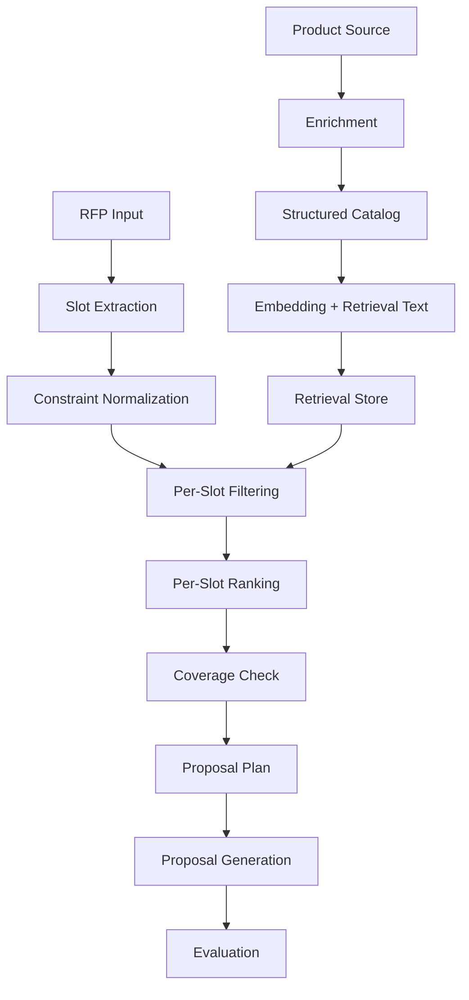

# Architecture

## System Summary

The system ingests hotel products, enriches them into structured retrieval units, maps unstructured RFPs into requirement slots, retrieves candidate matches per slot, and uses those matches to drive proposal planning and generation.

The core architectural choice is slot-based retrieval rather than whole-query document retrieval.

## Core Flow

## Architectural Thesis

The dominant failure mode is not "wrong top document". It is incomplete coverage across multiple simultaneous requirements such as venue, catering, accommodation, AV, and services.

That changes the retrieval unit from:

`RFP -> top K documents`

to:

`RFP -> requirement slots -> ranked candidates per slot -> coverage report`

## Bounded Contexts

### Catalog

Responsibilities:

- product acquisition
- enrichment
- taxonomy assignment
- retrieval text construction
- storage of structured product data

Primary output:

- `EnrichedProduct`

### Retrieval

Responsibilities:

- slot extraction from RFP text
- alias and constraint normalization
- hard filtering
- similarity ranking
- gap detection

Primary outputs:

- `RequirementSlot`
- `SlotMatch`
- `CoverageReport`

### Proposal

Responsibilities:

- convert coverage output into a proposal plan
- generate block content
- assemble proposal payloads

Primary output:

- proposal-ready content blocks and API payloads

### Evaluation

Responsibilities:

- score coverage
- detect constraint violations
- judge proposal coherence
- surface failure reasons

Primary output:

- `EvalResult`

### Run Orchestration

Responsibilities:

- stage transitions
- status tracking
- route-level execution
- result persistence

Primary output:

- `PipelineRun`

## Initial Data Model

The first shared contracts should cover:

- `RfpInput`
- `RequirementSlot`
- `EnrichedProduct`
- `SlotMatch`
- `CoverageReport`
- `ProposalPlan`
- `EvalResult`
- `PipelineRun`

## Dataset Assumptions to Validate

These assumptions should be verified during dataset exploration before retrieval logic is finalized.

- titles and descriptions contain enough signal for enrichment
- category is not reliably available in source payloads
- capacity, pricing, and amenities must be normalized from text
- some hard constraints can be extracted deterministically
- aliases and synonyms will be required for robust matching

## Retrieval Design

### Current Choice

The initial retrieval design is:

1. extract requirement slots
2. normalize aliases and hard constraints
3. filter candidates by category, capacity, budget, or availability when possible
4. rank filtered candidates by dense similarity
5. run coverage checks
6. retry missing slots with softened constraints where appropriate

### Why This Choice

- it matches the actual multi-requirement structure of the problem
- it uses deterministic filters where possible
- it keeps ranking explainable
- it produces outputs that evaluation can score directly

### Deferred Scale Enhancements

These belong later, not in the first slice:

- lexical hybrid retrieval inside slot search
- reranking on top filtered candidates
- database-backed faceting
- background indexing and caching

## Technology Decisions

- app runtime: Next.js App Router
- language: TypeScript
- validation: Zod
- tests: Vitest
- embeddings: OpenAI `text-embedding-3-small`
- structured extraction: Anthropic Haiku
- generation and judge: Anthropic Sonnet
- deployment: Vercel

## Storage Strategy

Initial implementation:

- seed products from fixtures
- keep a simple retrieval-store interface
- allow in-memory or fixture-backed retrieval for the first slice

Later:

- move structured catalog storage to a durable store
- preserve the same retrieval contract

## Quality Strategy

Primary quality dimensions:

- slot recall
- full requirement coverage
- hard-constraint violation rate
- within-slot ranking quality
- latency
- token cost

## Initial Risks

- over-modeling the domain before real payloads are inspected
- treating the problem like generic RAG
- mixing client and server responsibilities
- adding proposal generation before retrieval quality is proven
- overbuilding agent workflows before the main slice is stable

## First Vertical Slice

The first implementation milestone should stop at:

1. input RFP text
2. extract slots
3. match products per slot
4. return coverage and gap results

Proposal generation comes after that milestone is stable and tested.
